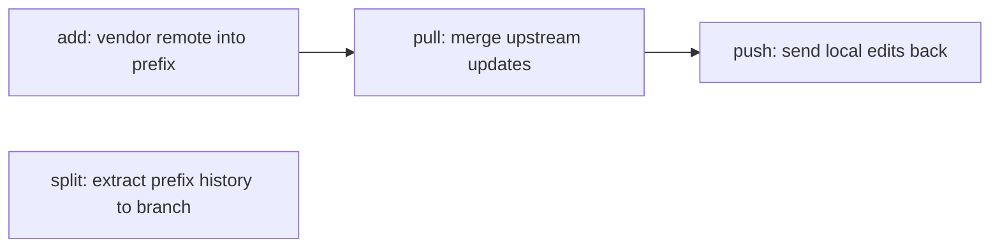

# git subtree

> Sources: Oluseye Jeremiah (DataCamp), 2026-03-25
> Raw: [git-subtree-explained](../../raw/git/2026-03-25-git-subtree-explained-a-practical-guide-with-examples.md)
> Updated: 2026-10-09

## Overview

`git subtree` embeds one Git repository inside another as a subdirectory, keeping full history and a two-way update path. Unlike a submodule pointer, subtree content is committed directly into your main repository, so a fresh clone works with zero extra steps — at the cost of a larger repo and merge-based update history.

## How it works

Adding a subtree fetches the remote's history, rewrites those commits under the chosen subdirectory, and merges the result into the current branch; later updates repeat the fetch-rewrite-merge pattern. What lands in your repo is actual files plus full history, not just a pointer or reference.

## The four commands

All four share the same `--prefix` pointing at the embedded directory:

```bash
git subtree add --prefix=<directory> <remote-url> <branch> --squash
git subtree pull --prefix=<directory> <remote-url> <branch> --squash
git subtree push --prefix=<directory> <remote-url> <branch>
git subtree split --prefix=<directory> -b <new-branch-name>
```

- **add** vendors the remote into the project for the first time and records the connection. Squash guidance: Use --squash unless you need to preserve detailed commit attribution from the original repo.
- **pull** merges upstream changes into the subdirectory. Two consistency rules: You must use the exact same prefix for all future operations, and If you used --squash during add, you should use --squash for every pull.
- **push** contributes local subtree edits back upstream by extracting and rewriting just that directory's history. Think of push as the reverse of pull. Pull brings changes in; push sends changes out. Requires write access to the upstream repo.
- **split** carves a subdirectory's history into its own branch (e.g. extracting a library out of a monorepo, or publishing a folder as a standalone project) without touching the original branch.



## subtree vs submodule

| Aspect | git subtree | git submodule |
|--------|-------------|---------------|
| Clone experience | one checkout, everything works | clone plus `git submodule update --init` |
| Repo size | larger (content plus history) | smaller (pointer to another repo) |
| Version pinning | merges ranges of commits | exact commit hash |
| Update flow | `git subtree pull` | manual pull inside the submodule |
| Push-back flow | `git subtree push` | normal push inside the submodule |
| Onboarding | clone once and run tests | must learn submodule mechanics |

Rule of thumb: submodule when you need exact version pinning, genuine project separation, or minimal repo size; subtree when you want no initialization steps, fewer Git concepts on the team, and vendoring with only occasional upstream pulls.

## When not to use it

- Repository size is a hard constraint (subtree inflates size with full content and history).
- Strict version pinning is required (submodules pin exact commits; subtree merges ranges).
- The upstream changes constantly (daily pulls make a messy merge history; a package manager may fit better).
- Organizational separation matters (different access, licensing, or ownership deserve separate repos).

## Pitfalls

- Mixing squashed and non-squashed updates confuses history — document the `--squash` choice in the project README.
- Changing `--prefix` between operations breaks the connection; keep it identical everywhere.
- Subtree directories are plain files, not repos — you cannot `cd` in and checkout versions.
- Local-only edits to vendored files collide with later pulls; push generally-useful changes back upstream.
- `push` rewrites history and can be slow on large subtrees.
